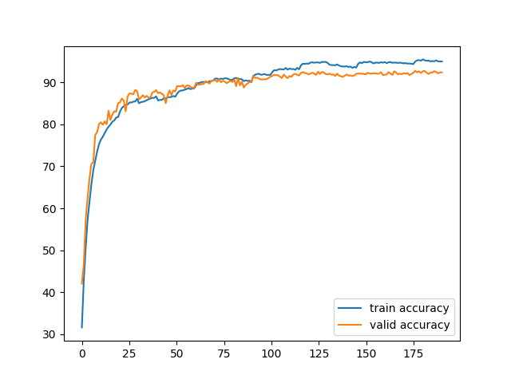

# Report

## The details of the model
The model's structure resembles ResNet, but since the model's size is restricted, the model only keeps parts of the ResNet structure, and the number of channels is smaller than ResNet.

### Main structure
The model's main structure is 

```
model:

conv1 -> manyResBlock1 -> conv2 -> manyResBlock2 -> conv3 -> manyResBlock3 -> conv4 -> manyResBlock4 -> AvgPool -> Linear
```

where each `conv` structure is actually a combination of one convolutional layer, one batch normalization layer and a max pooling layer:
```
conv:

Conv2d -> BatchNorm2d -> MaxPool2d -> Dropuout2d
```

My `manyResBlock` is a sequence of ResBlock(in the current model, there are normally 3 ResBlocks in each `manyResBlock`). For each ResBlock, the structure is like the original proposal of ResNet:

```
ResBlock:

Conv2d -> BatchNorm2d -> ReLU -> Conv2d ------->  ReLU
   |                                         |
   ----------------identity-------------------
```

### Sizes
We now list out the sizes of each layer in the model:

```
>>> input: 3 channels, 128*128

conv1: channels(3,64), kernel=7, stride=2, padding=3, maxpool 2, dropout=0.25

>>> output: 64 channels, 32*32

manyResBlock1: each conv has 64 channels, kernel=3, stride=1, padding=1. This block contains 4 ResBlocks.

>>> output: 64 channels, 32*32

conv2: channels(64,128), kernel=3, stride=2, padding=1, maxpool 2, dropout=0.35

>>> output: 128 channels, 8*8

manyResBlock2: each conv has 128 channels, kernel=3, stride=1, padding=1

>>> output: 128 channels, 8*8

conv3: channels(128,128), kernel=3, stride=1, padding=1, maxpool 2, dropout=0.35

>>> output: 128 channels, 4*4

manyResBlock3: each conv has 128 channels, kernel=3, stride=1, padding=1

>>> output: 128 channels, 4*4

conv4: channels(128,64), kernel=5, stride=1, padding=1, maxpool 2, dropout=0.25

>>> output: 128 channels, 4*4

manyResBlock4: each conv has 64 channels, kernel=3, stride=1, padding=1

>>> output: 64 channels, 4*4

AvgPool: kernel=4

>>> output: 64 channels, 1*1

resize to 64

linear: 64 -> 10
```

## Hyperparameters
I use Adam for the optimizer. During the whole training process, I also change the learning rate and weight decay rate based on the outputs per 10 or 15 epochs. Briefly speaking, my rules are:
1. If the validation accuracy is too smaller than the training accuracy, then increase the weight decay rate. The value of increment is basically based on my own thoughts. I save model every 10 or 15 epochs, so if the modification of hyperparameters make the model worse, I can go back to previous models.
2. If the training loss increases, then decrease the learning rate.
3. If the training loss(and accuracy) is random oscilating, then increase the learning rate and run for about 5 epochs.

The actual numbers are below:

```
epoch 0: lr 0.001000, weight_decay 0.000050
epoch 10: lr 0.001000, weight_decay 0.000080
epoch 20: lr 0.000800, weight_decay 0.000080
epoch 30: lr 0.001000, weight_decay 0.000060
epoch 40: lr 0.001200, weight_decay 0.000060
epoch 50: lr 0.001000, weight_decay 0.000060
epoch 60: lr 0.000800, weight_decay 0.000060
epoch 70: lr 0.000700, weight_decay 0.000100
epoch 80: lr 0.000600, weight_decay 0.000200
epoch 90: lr 0.000400, weight_decay 0.000250
epoch 100: lr 0.000300, weight_decay 0.000210
epoch 115: lr 0.000200, weight_decay 0.000270
epoch 130: lr 0.000230, weight_decay 0.000500
epoch 145: lr 0.000150, weight_decay 0.000700
epoch 160: lr 0.000140, weight_decay 0.000900
epoch 175: lr 0.000100, weight_decay 0.001500
```

## Tricks and Training Techniques
I will attribute the single most important trick to the data augmentation since it directly improves the validation accuracy from around 83% to the current 92%. I prepare the data so it passes through the following transformations before the `ToTensor` transform:

1. RandomHorizontalFlip
2. RandomCrop(size=128,padding=4)
3. RandomRotation(degrees=15)

Besides, I think the change in learning rate and weight decay is also important. Without them, the model will overfit, with a training accuracy near 100% and a validation accuracy below 80%.

The dropout layers in the model are also important. 

## Training Curve
The training curve is shown below:
