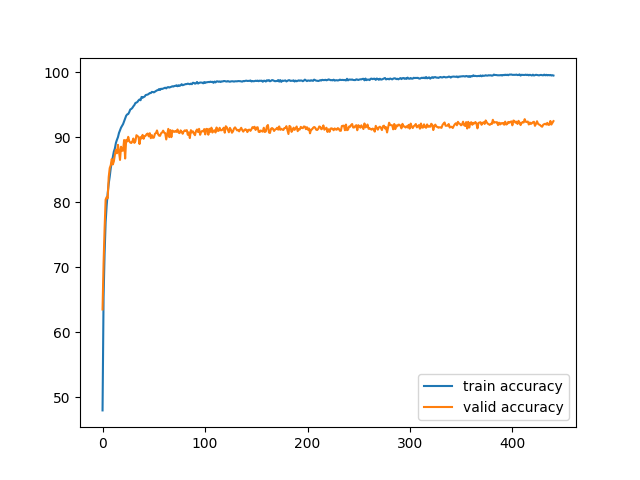

# Report

## The details of the model
The model's structure resembles ResNet, but since the model's size is restricted, the model only keeps parts of the ResNet structure, and the number of channels is smaller than ResNet.

### Main structure
The model's main structure is 

```
model:

conv1 -> manyResBlock1 -> conv2 -> manyResBlock2 -> conv3 -> manyResBlock3 -> AvgPool -> linear
```

where each `conv` structure is actually a combination of one convolutional layer, one batch normalization layer and a max pooling layer:
```
conv:

Conv2d -> BatchNorm2d -> MaxPool2d
```

The `linear` layer uses the original structure provided by the teacher, which is like
```
linear:

Linear -> ReLU -> Linear -> ReLU -> Linear
```

My `manyResBlock` is a sequence of ResBlock(in the current model, there are exactly 3 ResBlocks in each `manyResBlock`). For each ResBlock, the structure is like the original proposal of ResNet:

```
ResBlock:

Conv2d -> BatchNorm2d -> ReLU -> Conv2d ------->  ReLU
   |                                         |
   ----------------identity-------------------
```

### Sizes
We now list out the sizes of each layer in the model:

```
>>> input: 3 channels, 128*128

conv1: channels(3,64), kernel=7, stride=2, padding=3, maxpool 2

>>> output: 64 channels, 32*32

manyResBlock1: each conv has 64 channels, kernel=3, stride=1, padding=1

>>> output: 64 channels, 32*32

conv2: channels(64,128), kernel=3, stride=2, padding=1, maxpool 2

>>> output: 128 channels, 8*8

manyResBlock2: each conv has 128 channels, kernel=3, stride=1, padding=1

>>> output: 128 channels, 8*8

conv3: channels(128,128), kernel=3, stride=1, padding=1, maxpool 2

>>> output: 128 channels, 4*4

manyResBlock3: each conv has 128 channels, kernel=3, stride=1, padding=1

>>> output: 128 channels, 4*4

AvgPool: kernel=4

>>> output: 128 channels, 1*1

resize to 128

linear: 128 -> 256 -> 64 -> 10
```

## Hyperparameters
I use Adam for the optimizer. The model is trained automatically at night, so I also change the learning rate and weight decay rate automatically. The rules are relatively simple:

1. Don't change the learning rate and weight decay in the first 50 epochs. The initial values are `lr=2e-4` and `weight_decay=3e-5`
2. If the training accuracy is much larger than the validation accuracy, then increase weight decay by `1e-5` and decrease the learning rate by `5e-6` every 10 epochs. I intended to set the threshold accuracy difference to 0.1, or 10%, but it turns out that my code actually means that the threshold is 0.1%. This causes the learning rate and the weight decay to change every 10 epochs. However, the result turns out to be good.
3. If the learning rate is less than `4e-5`, then stop decreasing it; also, if the weight decay is more than `6e-4`, then stop increasing it.

The actual numbers are below:

```
epoch 0: lr 0.000200, weight_decay 0.000030
epoch 80: lr 0.000195, weight_decay 0.000040
epoch 90: lr 0.000190, weight_decay 0.000050
epoch 100: lr 0.000185, weight_decay 0.000060
epoch 110: lr 0.000180, weight_decay 0.000070
epoch 120: lr 0.000175, weight_decay 0.000080
epoch 130: lr 0.000170, weight_decay 0.000090
epoch 140: lr 0.000165, weight_decay 0.000100
epoch 150: lr 0.000160, weight_decay 0.000110
epoch 160: lr 0.000155, weight_decay 0.000120
epoch 170: lr 0.000150, weight_decay 0.000130
epoch 180: lr 0.000145, weight_decay 0.000140
epoch 190: lr 0.000140, weight_decay 0.000150
epoch 200: lr 0.000135, weight_decay 0.000160
epoch 210: lr 0.000130, weight_decay 0.000170
epoch 220: lr 0.000125, weight_decay 0.000180
epoch 230: lr 0.000120, weight_decay 0.000190
epoch 240: lr 0.000115, weight_decay 0.000200
epoch 250: lr 0.000110, weight_decay 0.000210
epoch 260: lr 0.000105, weight_decay 0.000220
epoch 270: lr 0.000100, weight_decay 0.000230
epoch 280: lr 0.000095, weight_decay 0.000240
epoch 290: lr 0.000090, weight_decay 0.000250
epoch 300: lr 0.000085, weight_decay 0.000260
epoch 310: lr 0.000080, weight_decay 0.000270
epoch 320: lr 0.000075, weight_decay 0.000280
epoch 330: lr 0.000070, weight_decay 0.000290
epoch 340: lr 0.000065, weight_decay 0.000300
epoch 350: lr 0.000060, weight_decay 0.000310
epoch 360: lr 0.000055, weight_decay 0.000320
epoch 370: lr 0.000050, weight_decay 0.000330
epoch 380: lr 0.000045, weight_decay 0.000340
epoch 390: lr 0.000040, weight_decay 0.000350
epoch 400: lr 0.000040, weight_decay 0.000360
epoch 410: lr 0.000040, weight_decay 0.000370
epoch 420: lr 0.000040, weight_decay 0.000380
epoch 430: lr 0.000040, weight_decay 0.000390
```

## Tricks and Training Techniques
I will attribute the single most important trick to the data augmentation since it directly improves the validation accuracy from around 83% to the current 92%. I prepare the data so it passes through the following transformations before the `ToTensor` transform:

1. RandomHorizontalFlip
2. RandomCrop(size=128,padding=4)
3. RandomRotation(degrees=15)

Besides, I think the change in learning rate and weight decay is also important. Without them, the model will overfit, with a training accuracy near 100% and a validation accuracy below 80%.

I also tried to use the Dropout layers in the model, but it turns out that the results are minimal. Thus, in the final model, there are no Dropout layers.

## Training Curve
The training curve is shown below:
